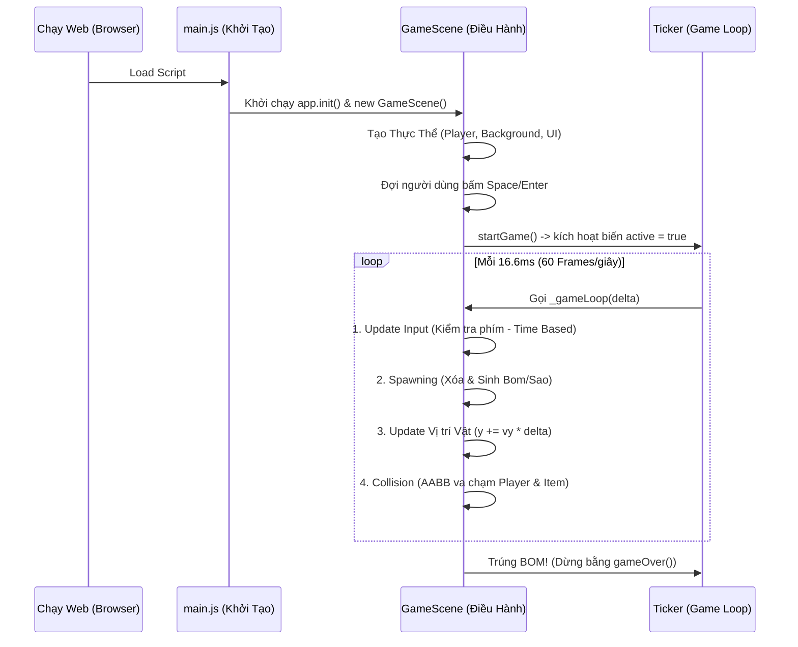

# 🎮 PixiDemo – Hứng Sao Tránh Bom

Bản tài liệu kiến trúc kỹ thuật dành cho dự án Game Web 2D sử dụng thư viện hệ sinh thái PixiJS. Được biên soạn đặc biệt để đối chiếu khái niệm với Java Web/Swing nhằm giúp quá trình tiếp cận trở nên trực quan và dễ hiểu nhất.

---

## 1. GIỚI THIỆU CHUNG (Introduction)

- **Tên game:** PixiDemo – Hứng Sao Tránh Bom.
- **Thể loại:** Casual / Arcade 2D.
- **Mục tiêu của người chơi:** Điều khiển tàu vũ trụ di chuyển qua lại để hứng các ngôi sao (⭐) rơi từ trên xuống nhằm ghi điểm (+10đ mỗi sao), đồng thời phải khéo léo lách tránh các quả bom (💣). Chạm phải bom sẽ dẫn đến Game Over ngay lập tức.
- **Công nghệ cốt lõi:**
  - **PixiJS (v8):** Render Engine Siêu Tốc (2D WebGL/Canvas).
  - **JavaScript (ES6+):** Ngôn ngữ xử lý logic hướng đối tượng (OOP).
  - **HTML5 / CSS3:** Tích hợp giao diện DOM, đóng gói ứng dụng web.
  - **Vite:** Công cụ Build Tool và Dev Server siêu nhanh.
- **Điểm nổi bật của dự án:**
  - **Kiến trúc mạch lạc:** Mã nguồn chia theo Component và System (phong cách Game Engine).
  - **Hiệu ứng đồ họa mượt mà:** Khóa mốc ở ~60fps thông qua API `PIXI.Ticker`.
  - **Tối ưu hóa quản lý bộ nhớ:** Giải phóng WebGL Texture chuẩn xác qua các hàm `destroy()`.
  - **Xử lý thuật toán:** Xử lý va chạm chuẩn AABB, thuật toán điều tốc theo Time-Based Movement (Delta Time) siêu ổn định.
  - **Không dùng ảnh tĩnh (No Assets Payload):** Toàn bộ thực thể vẽ bằng thuật toán Vector (PIXI.Graphics) - cực kỳ hiện đại.

---

## 2. CẤU TRÚC THƯ MỤC & THÀNH PHẦN DỰ ÁN (Project Structure)

Dự án tuân thủ mô hình phân chia cấu trúc vô cùng linh hoạt (Modular Organization), chia tách rõ ràng giữa Controller (Scene), Logic (Systems), và View (UI/Entities).

```text
pixidemo/
├── index.html                   # Entry point giao diện web, chứa thẻ <canvas>
├── package.json                 # Khai báo dependency (PIXI.JS) và scripts dự án
├── public/                      # Chứa tài nguyên tĩnh nguyên bản (favicon, svg, ...)
└── src/                         # MÃ NGUỒN CHÍNH
    ├── main.js                  # Lớp Khởi Tạo (≈ class Main chứa public static void main)
    ├── config.js                # Định nghĩa biến hằng (Tốc độ, FPS, Kích thước, ...)
    ├── assets/                  # Thư mục lưu trữ hình ảnh tải thêm hoặc âm thanh
    ├── entities/                # Thể hiện các đối tượng (Vật thể trong không gian game)
    │   ├── Item.js              # Định Nghĩa Lớp Đồ vật rơi (Sao/Bom)
    │   └── Player.js            # Định Nghĩa Lớp Tàu vũ trụ của người chơi
    ├── scenes/                  # Quản lý Cảnh (Scenes Controller)
    │   └── GameScene.js         # Core Game Controller xử lý vòng lặp và logic chính
    ├── systems/                 # Chứa các bộ công cụ kiểm tra (Logic Modules)
    │   ├── CollisionSystem.js   # Bộ Kiểm tra Va chạm (AABB Collision)
    │   └── InputSystem.js       # Bộ Lắng nghe Bàn phím động (Event Loop Input)
    ├── ui/                      # Đồ hoạ thông tin trên màn hình (UI/UX Layer)
    │   ├── HUD.js               # Hiển thị điểm số (Heads-Up Display)
    │   └── Overlay.js           # Màn hình chờ (Overlay Start/Game Over)
    └── style.css                # CSS bố cục HTML
```

### Giải thích vai trò cốt lõi:
- **`entities/` (Mô hình/Model):** Tạo ra cấu trúc dữ liệu đồ họa đại diện cho vật thể độc lập (ví dụ, tàu bay hay quả bom). Trả về `PIXI.Container` hoặc `PIXI.Graphics`.
- **`systems/` (Quy tắc/Rules):** Các lớp chứa hàm tĩnh logic thuần túy (Static Utils) như kiểm tra chạm vào nhau hoặc giữ rịt phím.
- **`scenes/GameScene.js` (Bộ Điều Khiển Trung Tâm/Controller):** Nơi ràng buộc Models, View, và Systems để vận hành Game Loop.
- **`ui/` (Giao Diện Chồng/Overlay):** Vẽ Text, các bảng điểm, thông báo ở lơ lửng đè lên Canvas.

---

## 3. LUỒNG HOẠT ĐỘNG CỦA GAME (Game Flow & Architecture)

Luồng hoạt động của game theo phong cách Polling Loop liên tục lặp lại các thao tác tại 60 FPS:



### Các trạng thái (Game States):
1. **Khởi tạo và chờ (Start):** Render toàn bộ, đặt Player ở giữa màn hình. Hiện layer `Overlay` bấm phím.
2. **Đang chơi (Playing):** Biến `_gameActive = true`. Game Loop thực thi kiểm tra toạ độ. Vận tốc và khó khăn (Spawning Interval) được tính toán theo độ trượt Frame.
3. **Kết thúc (Game Over):** Gián đoạn Ticker. Chơi dồn hiệu ứng nhấp nháy đỏ trên Background của Render. Hiển thị lại `Overlay` bảng kết quả điểm số.

---

## 4. GIẢI THÍCH CHI TIẾT CÁC HÀM & API CỦA PIXI.JS (Deep Dive Pixi.js APIs)

Dưới đây là bảng đối chiếu mạnh mẽ giữa các khái niệm Pixi.js và Lập trình ứng dụng Web/Game trong không gian mạng Java (Swing/AWT) giúp bạn có tư duy bắc cầu nhanh chóng:

| Nhóm Đối Tượng/Hàm của PixiJS | Khái Niệm Tương Đương Trong Java (Swing) | Phân Tích Công Dụng Thực Tế Trong Framework |
| :--- | :--- | :--- |
| **`PIXI.Application`** | Khởi tạo lớp bao hàm `JFrame` + Canvas | Đối tượng gốc của Engine. Chịu trách nhiệm quản lý `<canvas>`, WebGL Renderer nội bộ và chu kỳ Vòng lặp thời gian. |
| **`PIXI.Container`** | Lớp thùng chứa `JPanel` hay `ViewGroup` | Một vật chứa Logic không có hình ảnh mặc định. Quản lý danh sách các node con (`children`). Ví dụ: Chứa buồng lái + thân tàu để biến thành 1 "Container Tàu". |
| **`PIXI.Graphics`** | Cọ xoong `Graphics2D` (`fillRect`, `draw`) | Component cung cấp API thao tác vẽ Vector. Dùng để gọi các hàm nguyên thủy `poly()`, `circle()`, `rect()` thay cho việc đưa Sprite tĩnh bitmap vào (giảm payload). |
| **`PIXI.Text`** | Hộp thoại `JLabel` \/ `java.awt.Font` | Dựng văn bản chữ. Có khả năng mix style cầu kỳ (`fontWeight`, `dropShadow`) thông qua class bổ trợ cấu hình `PIXI.TextStyle`. |
| **`PIXI.Ticker`** | Vòng lặp `Thread` lặp + hàm `repaint()` | Hệ thống quản lý Vòng lặp. Callback được kích hoạt liên tục trên mỗi frame render qua màn hình (thường là 60 fps). Nó đẩy ra object `delta` (sai số thời gian). |

### Các phương thức thực tế được gọi trong code:
- `app.init({ width, height })`: Pattern phiên bản Pixi V8 - tạo Renderer WebGL theo Async (bất đồng bộ).
- `app.stage.addChild(child)`: 100% tương đương với `JFrame.add(Component)`. Gắn object hiển thị vào cây hiển thị trên cùng (Stage).
- `app.ticker.add(callback)`: Thêm hàm xử lý vào Vòng lặp Ticker. Hàm tick này sẽ chạy trước khi Scene Render vẽ ảnh mới.
- `container.pivot.set(x, y)`: Định gốc tọa độ địa phương trung tâm quay. Không set mặc định vẽ từ Góc Trái Trên (0,0).
- `graphics.rect(x, y, w, h).fill(color)`: Nối lệnh của API V8. Vẽ hình chữ nhật trước, rồi sau đó mới xả cọ tạo màu.
- `container.destroy({ children: true })`: Tương đương `dispose()`. Ra lệnh cho thư viện dọn sạch bộ nhớ trên cạc đồ hoạ Video WebGL để chống rò rỉ RAM rác.

---

## 5. GIAO DIỆN DEMO GAME & THUẬT TOÁN CỐT LÕI (UI & Core Algorithm)

### Mô tả cực nét Giao Diện Web
* **Khung Canvas:** 480x640px, dọc gọn gàng theo tỉ lệ điện thoại di động (Portrait Mode).
* **Môi trường (Background):** Phông nền xanh đen đậm (`0x0d0d1a`), trên đó sinh rải rác những Graphic Circles Alpha bán mờ đại diện cho hàng sa số thiên hà lấp lánh tĩnh mịch.
* **Người dùng (Player):** Phi thuyền được xây từ Graphic Poly tím mộng mơ với Pivot được đẩy về bụng đít tàu.
* **Vật phẩm rơi (Spawning Entities):**
  * **Bom (40%):** Quả bom đen viền đỏ + dây vàng trên đầu.
  * **Sao (60%):** Đóng từ đồ thị đa giác cắt viền mười múi của ngôi sao hoàn chỉnh bằng toán học Cos/Sin.
* **Giao diện lớp trên (HUD/Overlay):** Có bóng shadow chuyên sâu.

### Các Thuật Toán Xương Sống:

#### 1. Thuật toán Xử Lý Va Chạm 2D (AABB Collision)
Game chạy qua lớp `CollisionSystem.check(player, item)`. Hệ tư duy trục tọa độ song song.
Công thức AABB dựa trên nguyên lý: **Hai khối hộp va vào nhau chỉ khi phần biên (vùng ranh giới) giẫm chân lên nhau ở CẢ 2 TRỤC đồ thị.**
$$
\text{Giao cắt} \iff (px_1 < ix_2) \land (px_2 > ix_1) \land (py_1 < iy_2) \land (py_2 > iy_1)
$$
*Trong Code (Tọa độ tính cả pivot):*
Kiểm tra Điểm X bên Trái nhỏ hơn Điểm X bên Phải đối phương, VÀ X Phải lớn hơn X Trái đối phương... 

#### 2. Thuật Toán Rơi Hạt Cơ Bản (Interval Spawner)
Sử dụng toán học khống chế Nhịp Độ bằng Modulo vòng quay (`%`). Nó được kích hoạt lúc đếm Frame `_frameCount % SPAWN_INTERVAL === 0`.
Độ khó Game còn sử dụng một hàm gia công gia tốc toán học (đẩy tốc độ rơi theo số điểm có):
$$
\text{Interval} = \max\left(30, 90 - \left\lfloor\frac{\text{score}}{50}\right\rfloor \times 5\right)
$$
=> Chia cứ 50 điểm sẽ làm rơi nhanh hơn (Tần suất sinh hẹp lại), Max ping cho ngưỡng 30 Frame (Nửa Giây là sinh bom sao).

---

## 6. HƯỚNG DẪN CHẠY DỰ ÁN (How to Run)

Đây là một Node.js Web Project thông qua Vite Toolchain. Các bước cực kỳ tiêu chuẩn:

1. Yêu cầu tải **Node.js** phiên bản v18 trở lên.
2. Mở trình duyệt Terminal / CMD / Powershell nhảy vào thư mục `pixidemo`.
3. Tải các gói Package Dependency của Pixi & Vite:
   ```bash
   npm install
   ```
4. Kích hoạt Development Web Server:
   ```bash
   npm run dev
   ```
5. Mở trình duyệt với Link localhost được Node xả ra (Ví dụ: `http://localhost:5173`). Bạn có thể sửa Code và nóng (Hot-reload) cập nhật thay đổi ngay trên màn hình.
6. Chơi Game: **Sử dụng Bàn phím Mũi Tên Sang Trái / Sang Phải** và **Space/Enter** để tương tác.

---

💼 *Biên soạn chuẩn định dạng Github Repository để Showcase trong Môi trường Tuyển dụng.*
